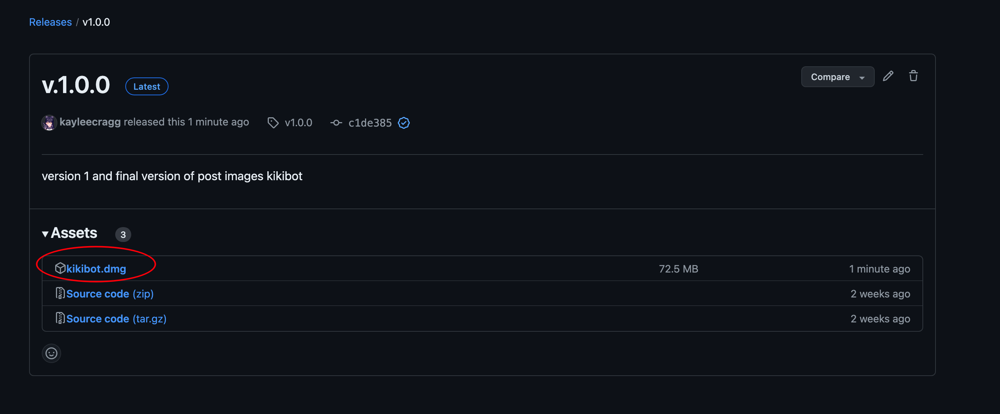

# **postbot**

This application allows users to automate the process of making post match images through proxy of tile-creator, by using the pre-entered data sheet that made the pre-images.

You can download the post images app [here](https://github.com/kayleecragg/postbot/releases/tag/v1.0.0 )

- Download kikibot.dmg

- Once it’s been downloaded:

- Double click on kikibot.dmg in your downloads folder and it should open up in a window like this:

  

- Double click on kikibot AGAIN and the next window should open up:

  

- Make sure the information is correct (it should be by default) and make sure to adjust the timer to your level of comfortableness - 30 seconds works fine most of the time.
- Then click ‘run the game' and the bot should run. 
- Remember to have your pre-curated folder of images to drag into tile creator other wise you’ll be left scrambling!
